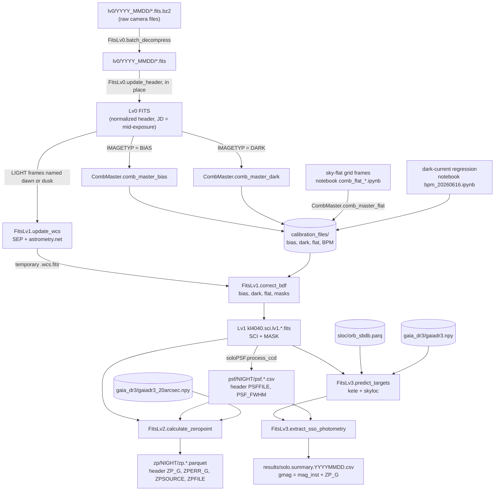

# solopy — Primitive Repository Analysis

> **Snapshot:** `main` @ `82036f8` ("fix the photometric bug", 2026-07-04) · package version `1.0.0` · analyzed 2026-10-06
> **Scope:** every tracked file in this repository, plus how the package is actually used on the data in
> `~/Desktop/data/solo` and `/Volumes/T7/data/solo` (§9).
> Numbers quoted in §9 were measured directly from those folders, logs, and FITS headers on 2026-10-06.

## Contents

1. [What solopy is](#1-what-solopy-is)
2. [Repository layout](#2-repository-layout)
3. [End-to-end workflow](#3-end-to-end-workflow)
4. [Module reference (file by file)](#4-module-reference-file-by-file)
5. [FITS header keywords written by the pipeline](#5-fits-header-keywords-written-by-the-pipeline)
6. [Output products and schemas](#6-output-products-and-schemas)
7. [Dependencies and environment](#7-dependencies-and-environment)
8. [Known issues and caveats (code)](#8-known-issues-and-caveats-code)
9. [Usage in `data/solo` — actual operation](#9-usage-in-datasolo--actual-operation)
10. [Glossary](#10-glossary)

---

## 1. What solopy is

`solopy` is a single-author Python package (Bumhoo Lim) that reduces imaging data from **SOLO — the Solar system
Object Light-curve Observatory**:

| Item | Value (from FITS headers / code constants) |
|---|---|
| Telescope | Rowe-Ackermann Schmidt Astrograph 11" (RASA), f = 620 mm, D = 279.4 mm |
| Camera | FLI KL4040FI, GSENSE4040 FI CMOS, 4096 × 4096, 9 µm pixels |
| Plate scale / FoV | ≈ 2.974 ″/px (astrometric solution) → ≈ 3.4° × 3.4° |
| Gain / read noise | `EGAIN` = 18.69 e⁻/ADU, `RDNOISE` = 3.7 e⁻ (hard-coded in `FitsLv0`) |
| Filter | clear (`FILTER = CLEAR`) |
| Site | Sierra Remote Observatories, MPC code G80, lon −119.4°, lat +37.07°, 1.405 km |

It turns raw FITS frames into **Gaia-G-calibrated photometry of every known asteroid brighter than V = 16.5 in each
field**, through four processing levels:

| Level | Class(es) | What it does | Main output |
|---|---|---|---|
| Lv0 | `FitsLv0` | decompress `.fits.bz2`; normalize and enrich headers in place | raw `.fits` with a standard header |
| masters | `CombMaster` | master bias, dark (per exposure time), flat | `kl4040.{bias, dark.<t>s, flat.clear}.comb.<date>.fits` |
| Lv1 | `FitsLv1` | plate solve (astrometry.net); bias/dark/flat correction; bad-pixel mask | `kl4040.sci.lv1.*.fits` (SCI + `MASK` HDUs) |
| Lv2 | `soloPSF`, `FitsLv2` (+ `GaiaQuery`, `SOLORegion`) | tile-wise PSF FWHM map; aperture photometry of Gaia stars; zero point | `psf.*.csv`, `zp.*.parquet`, header `PSF_FWHM`, `ZP_G` |
| Lv3 | `FitsLv3` | predict asteroid positions (kete + skyloc N-body); centroid + aperture photometry; flag Gaia blends | `solo.summary.<YYYYMMDD>.csv` |

The repository is a **library only**. The production driver lives outside the repo, in
`~/Desktop/data/solo/notebooks/main.py` (see §9).

---

## 2. Repository layout

```
solopy/                         git root · remote git@github.com:bumhooLIM/solopy.git · branch main
├── pyproject.toml              setuptools build; name/version 1.0.0; declared deps (incomplete, see §7)
├── README.md                   only "# solopy"
├── .gitignore                  caches, venvs, build, *.egg-info, fig/, data/, doc/, CLAUDE.md, handoff.md
├── claude_doc/
│   └── primitive_repo.md       this document
├── notebooks/
│   └── main.py                 first-generation example driver (stale, see §4.11)
└── solopy/                     the package
    ├── __init__.py             star-imports every public module
    ├── fitslv0.py              FitsLv0    – Lv0 decompression + header normalization
    ├── combmaster.py           CombMaster – master bias / dark / flat
    ├── fitslv1.py              FitsLv1    – WCS solve + bias/dark/flat correction + masking
    ├── psf.py                  soloPSF    – tile-wise PSF / FWHM measurement
    ├── region.py               SOLORegion – 500-px tiling geometry
    ├── gaia.py                 GaiaQuery  – Gaia DR3 (.npy memmap) queries
    ├── fitslv2.py              FitsLv2    – extraction, matching, photometry, zero point
    ├── fitslv3.py              FitsLv3    – asteroid prediction + photometry
    ├── _fileutil.py            helpers (clear_dir is used by CombMaster; the rest is unused)
    ├── _utils.py               bz2 batch (de)compression (duplicate of FitsLv0; unused)
    └── _ccdutil.py             CCDData helpers (cutout / transpose / flip / normalize; not imported)
```

Local, untracked: `solopy.egg-info/` (editable install), `__pycache__/`, `.DS_Store`, plus the gitignored
`CLAUDE.md` and `handoff.md`.

**History.** 50 commits, 2025-09-25 → 2026-07-04, one author. Rough phases: bz2 + Lv0 headers (2025-09) →
Lv1 + `CombMaster` (2025-10/11) → master flat and streak mask (2025-11/12) → Lv2 zero point (2025-12 → 2026-06) →
Gaia query and PSF tiling (2026-06) → Lv3 asteroids and version 1.0.0 (2026-06-17) → mask and photometry fixes
(2026-06-23 → 2026-07-04).

---

## 3. End-to-end workflow



Per-night sequence, as implemented by the external driver `main.py`:

1. **Lv0** — decompress every `*.fits.bz2` in the night folder in place (originals deleted), then rewrite each header.
2. **Masters** — combine that night's `BIAS` frames, then its `DARK` frames (bias-subtracted, grouped by exposure time).
3. Load the **fixed** master flat (`kl4040.flat.clear.comb.20260526.fits`) and bad-pixel mask (`kl4040.bpm.20260616.fits`).
4. **Lv1** — for each `LIGHT` frame whose `OBJECT` starts with `dawn` or `dusk`: plate solve → bias/dark/flat + masks →
   write the Lv1 file → delete the temporary `.wcs.fits`.
5. **Lv2** — for each Lv1 frame: tile PSF map (CSV + `PSF_FWHM`) → Gaia zero point (parquet + `ZP_G`).
6. **Lv3** — for all Lv1 frames of the night: predict asteroids → centroid + photometry → `gmag`, `gmag_distcorr` →
   one CSV per UTC observation date.

---

## 4. Module reference (file by file)

### 4.1 `solopy/__init__.py`

```python
from .fitslv0 import *; from .fitslv1 import *; from .fitslv2 import *; from .fitslv3 import *
from .combmaster import *; from .gaia import *; from .psf import *; from .region import *
```

- No `__all__`, so the `solopy` namespace also exposes every name those modules import (`np`, `fits`, `kete`, …).
  The intended public API is `FitsLv0`, `CombMaster`, `FitsLv1`, `FitsLv2`, `FitsLv3`, `soloPSF`, `SOLORegion`, `GaiaQuery`.
- **Side effect:** `import solopy` imports `kete` and `skyloc` (through `fitslv3`) and `astroquery` (through `fitslv2`).
  In an environment without them the whole package fails to import (verified in the miniconda *base* env:
  `ModuleNotFoundError: No module named 'kete'`).
- `_ccdutil`, `_fileutil`, `_utils` are not re-exported.

### 4.2 `solopy/fitslv0.py` — `FitsLv0` (Level 0)

| Method | Behavior |
|---|---|
| `__init__(log_file=None)` | Logger `FitsLv0` (console + optional file); guarded against duplicate handlers; `propagate=False`. |
| `batch_decompress(in_dir, out_dir, delete_source=False)` | Streams every `*.fits.bz2` in `in_dir` to `out_dir/<name>.fits` (tqdm progress). Deletes the partial output on failure; optionally deletes the source. |
| `update_header(fpath_fits)` | Opens the file with `mode='update'` and edits only the header on disk (data not loaded). Details below. |

`update_header` ([fitslv0.py:67](../solopy/fitslv0.py#L67)):

- **Cleanup:** removes every `HISTORY` card and `ELAV`.
- **Normalization:** casts and annotates `EXPTIME`, `CCDTEMP`, `PIXSZ`, `FOCALLEN`, `APTDIA`, `FOCUS`; upper-cases
  `OBSERVER` and `IMAGETYP`; sets `BUNIT='adu'`, `FILTER='CLEAR'`; strips a Windows path prefix from `OBJECT`.
- **Time** ([L113–125](../solopy/fitslv0.py#L113)): reads `UTC-END` (fallback `UTC`) as end of exposure and computes
  mid-exposure `t = UTC-END − EXPTIME/2`. Writes `JD`, `MJD-OBS`, `DATE-OBS`, `UTC` (all mid-exposure), `UTC-STA`,
  `UTC-END`, and `OBSDATE` (UTC `YYYYMMDD`). Re-running is idempotent, because `UTC-END` is rewritten consistently.
- **Constants:** `INSTRUME`, `DETECTOR`, `EGAIN=18.69`, `RDNOISE=3.7`, `OBSERVAT`, `OBSCODE='G80'`, `LON`, `LAT`,
  `ELEVAT`, `TELESCOP`.
- **Pointing:** sexagesimal `RA` (hours), `DEC`, `ALT`, `AZ` → degrees.
- **Flags:** `BIASCORR = DARKCORR = FLATCORR = False`, `DATLEVEL = 0`, `COMBINED = False`.
- **Geometry at mid-exposure for the telescope pointing:** `SELONG` (solar elongation), `MELONG` (lunar elongation),
  `GXLAT`/`GXLON` (Galactic), `ECLAT`/`ECLON` (true ecliptic of date).
- Appends a `HISTORY` line.

### 4.3 `solopy/combmaster.py` — `CombMaster` (master calibration frames)

| Method | Behavior |
|---|---|
| `__init__(log_file=None)` | Logger `CombMaster`. Adds handlers on every call (see §8, issue 5). |
| `_load_ccd_list(files)` | → `[(CCDData, Path)]`; retries with `unit='adu'`; logs and skips failures. |
| `_find_closest_bias(master_dir, target_jd)` | `ImageFileCollection(..., glob_exclude='*._*.fits').filter(imagetyp='BIAS')` → smallest \|JD − target\|. |
| `_find_closest_dark(master_dir, target_jd, target_exptime)` | Among `DARK` masters: closest `EXPTIME` first (warns if more than 1 s off), then closest JD. |
| `_ccd_sigmaclip(ccd, nsigma=3)` | SEP background; pixels outside `back ± nsigma·globalrms` → NaN (removes stars and outliers from sky flats). Records `BKGMED` and `BKGRMS` in ADU/s. |
| `comb_master_bias(frames, master_dir, outname)` | `ccdproc.combine`: median, 5σ clipping (median ± 5·MAD-std), float32, 500 MB memory limit → `{outname}.bias.comb.{OBSDATE}.fits`. |
| `comb_master_dark(frames, master_dir, outname)` | Subtracts the master bias closest in JD to the first dark; groups by `EXPTIME`; combines each group as above → `{outname}.dark.{t}s.comb.{OBSDATE}.fits`. |
| `comb_master_flat(frames, master_dir, outname)` | Per frame: closest bias → closest dark (exposure-scaled) → `_ccd_sigmaclip(nsigma=2.5)` → written to `master_dir/tmp/`. Then combines the temporary files with **inverse-median scaling** (each frame normalized to median 1), median, 3σ clipping → `{outname}.flat.{filter}.comb.{today}.fits`, and empties `tmp/`. |

ccdproc's default combine median is NaN-aware, so the NaN-masked stars in sky flats do not contribute.
The flat file name carries the **creation** date, not an observation date ([combmaster.py:538](../solopy/combmaster.py#L538)).

### 4.4 `solopy/fitslv1.py` — `FitsLv1` (Level 1)

**`update_wcs(fpath_fits, outdir, cache_directory="astrometry_cache", verbose=False, return_fpath=True)`**
([fitslv1.py:41](../solopy/fitslv1.py#L41))

1. Read as `CCDData`; record `LV0FILE`.
2. SEP background + extraction (3 × global RMS, `minarea = 5`); keep the 50 brightest sources.
3. Solve with the `astrometry` package ([L94–107](../solopy/fitslv1.py#L94)): 4100-series index files, scales 8–10
   (downloaded into `cache_directory` on first use); scale hint 2.90–3.00 ″/px; position hint = header RA/Dec within 2°;
   stop after 10 matches over the log-odds threshold; SIP order 3.
4. On success: write the TAN-SIP WCS and `PIXSCALE`; compute `RACEN`/`DECCEN` at pixel (2048, 2048), and
   `ALTCEN`/`AZCEN` at the header `JD` from the site `LAT`/`LON`/`ELEVAT`.
5. Write `<stem>.wcs.fits` to `outdir` **even when the solve failed** (no WCS cards then), and return its path.

**`correct_bdf(fpath_fits, outdir, masterdir, ccdmflat, ccdmask=None, return_fpath=True)`**
([fitslv1.py:174](../solopy/fitslv1.py#L174))

1. Read the frame and copy its WCS into the header. A frame without WCS raises here, and the method returns `None`.
   This is where unsolved frames actually drop out of the pipeline.
2. Select masters with `_select_master`: bias by closest JD; dark by closest `EXPTIME`, then closest JD.
3. `ccdproc.subtract_bias` → `subtract_dark` (scaled by `EXPTIME`) → `flat_correct` (normalized by the flat mean).
4. Build the mask (OR of all):

   | Mask | Rule |
   |---|---|
   | saturated | raw value ≥ 3800 ADU |
   | border | 100-px frame edge |
   | negative | value < 0 after dark subtraction |
   | bad pixels | after flat: ≤ 0, NaN, or Inf; flat NaN/Inf; flat > 1.5 or ≤ 0.4 |
   | bright / streak sources | `_mask_source` (below) |
   | external BPM | `ccdmask` argument |
   | pre-existing | `sci.mask` |

5. Header: `BIASCORR`/`DARKCORR`/`FLATCORR = True`, `BIASNAME`/`DARKNAME`/`FLATNAME`/`MASKNAME`, `NBADPIX`,
   `DATLEVEL = 1`, `FILENAME`.
6. Name ([L271–282](../solopy/fitslv1.py#L271)): `kl4040.sci.lv1.{RA:03d}.{p|n}{|Dec|:02d}.{EXPTIME:03d}.{DATE-OBS as YYYYMMDDhhmmss}.fits`,
   from `RACEN`/`DECCEN` rounded to degrees. Fallback name: `<stem>.lv1.fits`.
7. Write a float32 primary HDU plus a `MASK` uint8 image extension.

**Private helpers**

- `_select_master(masterdir, imagetyp, jd_target, exptime=None)` — caches each directory's `ImageFileCollection`
  summary as a DataFrame; filters `IMAGETYP`; chooses the closest `EXPTIME` (if given), then the closest JD.
  It does not consider `CCDTEMP`.
- `_mask_source(data, minarea=π·12² ≈ 452 px, ratio=3)` — SEP extraction at 2.5σ with a segmentation map.
  Round (a/b < 2) sources of at least 452 px get a circular mask (radius = farthest segment pixel + 1).
  Elongated sources (a/b ≥ 3, satellite and aircraft trails) have their segment pixels masked.

### 4.5 `solopy/region.py` — `SOLORegion`

- `SOLORegion(image_shape, base_tile_size=500)`: `floor(N / 500)` tiles per axis; the last tile absorbs the remainder.
  A 4096-px axis gives 8 tiles: seven of 500 px and one of 596 px, so a frame has 64 tiles.
- `find_region(x, y)` → `(i, j)`, capped at the last tile. `get_tile_info(i, j)` → start/end/size/center.
- Used by `soloPSF` (tiling), `FitsLv2.perform_photometry` (FWHM lookup), and the notebooks (heat maps).

### 4.6 `solopy/psf.py` — `soloPSF`

`soloPSF(init_fwhm=2.5, n_star=20, peakmin=300, peakmax=3000, max_ab_ratio=2.0, max_deviation=3.0, base_tile_size=500)`;
cutout size = `int(5 · init_fwhm)` = 12 px.

`process_ccd(image)` ([psf.py:179](../solopy/psf.py#L179)) loops over the `SOLORegion` tiles. For each tile:

1. `_extract_psfs`: SEP background; extraction at 3σ (`minarea = π(init_fwhm/2)²`); keep sources with
   300 < peak < 3000 ADU (not faint, not saturated) and a/b ≤ 2 (no trails or cosmic rays); keep the 20 brightest;
   drop those within half a cutout of the tile edge. Each 12 × 12 cutout has its local sky subtracted (σ-clipped
   median in a 4–6 × `init_fwhm` annulus, photutils `ApertureStats`) and is normalized to unit sum.
2. `_fit_gaussians`: astropy `Gaussian2D` with `LevMarLSQFitter` (σ bounded positive). Non-converged fits are
   rejected. FWHM = 2.3548 · √(σx · σy). A fit is flagged if its center moved more than 3 px.
3. Keep 1.5 < FWHM < 8 px. Report `fwhm_avg/median/stddev`, `theta_avg`, `peak_min/max`, `n_star`, and the
   **median-stacked** normalized PSF image (`avg_psf_data`).

It returns a DataFrame with one row per tile that had at least one valid star.
Side effect: importing the module silences `AstropyUserWarning` and `RuntimeWarning` globally.

### 4.7 `solopy/gaia.py` — `GaiaQuery` (static methods)

Catalog format: a structured NumPy `.npy` file, memory-mapped, with fields
`source_id, phot_bp_mean_mag, phot_rp_mean_mag, phot_g_mean_mag, ra, dec`.

- **`query_gaia(wcs, gaia_data, gaia_mag_upper_limit=18, gaia_mag_lower_limit=13, gaia_band='g', filter_nearby_sources=True, dist_thresh_pix=15, bright_star_dist_thresh_pix=50)`** — one frame:
  1. RA/Dec box of the four image corners plus a 0.1° buffer (handles RA wrap-around).
  2. Pixel coordinates via `world_to_pixel_values`; keep those inside the image ± 10 px.
  3. Targets: lower < G < upper. "Bright stars": G ≤ lower.
  4. Drop targets whose nearest other target is closer than 15 px (KD-tree), or that lie within 50 px of a bright star.
- **`query_gaia_subset(wcs_input, gaia_data, …)`** — many frames: one box per frame, overlapping boxes merged
  iteratively, a single boolean pass over the catalog, then a magnitude cut. The notebooks use it to shrink
  247.5 M rows to about 1.7 M before cross-matching.
- **`query_nearest_gaia(target_coords, gaia_data, gaia_band='g')`** — `SkyCoord.match_to_catalog_sky` → one
  `(source_id, mag, separation_arcsec)` tuple per target.
- Private: `_boxes_overlap`, `_merge_bounding_boxes`.

### 4.8 `solopy/fitslv2.py` — `FitsLv2` (Level 2)

| Method | Behavior |
|---|---|
| `sep_extract_source(data, mask=None, fwhm=2.0, thresh=2.5)` | SEP background (masked); extraction at `thresh` × local RMS, `minarea = π(fwhm/2)²`; returns a DataFrame. |
| `match_catalogs(source_cat, ref_cat, tolerance=3.0, ...)` | Nearest neighbour in pixel space (cKDTree, ≤ 3 px); suffixes `_source`/`_ref`; adds `separation_pix`; 3σ-clips the separations. |
| `find_centroid(data, sources, fwhm=2.0, mask=None, x_col, y_col)` | Background-subtracted `sep.winpos` windowed centroid (σ = FWHM/2.355); keeps `winpos_flag == 0`; adds `x_winpos`, `y_winpos`. |
| `perform_photometry(...)` | Spatially varying aperture photometry, below. |
| `calculate_zeropoint(...)` | Per-frame zero point, below. |

**`perform_photometry(data, sources, exptime, err=None, mask=None, fwhm=2.5, psf_table=None, base_tile_size=500, ap_in_out=(2.5, 4, 6), x_col, y_col, remove_bad_sources=False)`**
([fitslv2.py:249](../solopy/fitslv2.py#L249))

1. Each source takes its tile's `fwhm_avg` from the PSF table (missing tile → global median; clipped to [1.5, 10] px)
   → `mapped_fwhm`.
2. Sources are grouped by FWHM. Radii: aperture `k₀·FWHM`, annulus `k₁…k₂·FWHM` from `ap_in_out`.
3. `aperture_photometry` with the error map and mask. Sky = 3σ-clipped median and std in the annulus. Since commit
   `82036f8`, `aperture_area` is the **unmasked** aperture area. `nbadpix` counts masked pixels in the aperture;
   `badphot = (nbadpix > 0) or (flux ≤ 0)`.
4. flux = sum − area · sky; σ² = Σσ²(pixels) + area · σ²(sky) + area² · σ²(sky) / n(sky); `snr`;
   `mag_inst = −2.5 log10(flux / exptime)`; `mag_err = 1.0857 / snr`.

**`calculate_zeropoint(fpath_fits, gaia_data, outdir_zp, mag_lower=13, mag_upper=18, psf_table=None, base_tile_size=500, fallback_fwhm=2.5, ap_in_out=(2.5, 4, 6))`**
([fitslv2.py:526](../solopy/fitslv2.py#L526))

1. Read SCI and MASK. Error map: σ = √(max(data, 0)/gain + (RN/gain)²) in ADU. Global FWHM = header `PSF_FWHM`.
2. `GaiaQuery.query_gaia` with 12 < G < 18, 15-px isolation, 50 px from G ≤ 12 stars.
3. SEP extraction (3σ) → match within 3 px → keep `mag_lower ≤ G ≤ mag_upper`. Centroiding is currently skipped;
   SEP positions are used ("temporary", [L599](../solopy/fitslv2.py#L599)).
4. Photometry with `remove_bad_sources=True`.
5. ZP = median of 3σ-clipped (G − m_inst); `ZPERR_G` = their std; `ZPSOURCE` = N.
6. Save `zp.<stem>.parquet`; write `ZP_G`, `ZPERR_G`, `ZPSOURCE`, `ZPFILE` into the Lv1 header with `fits.setval`.

Commented-out legacy code in this file: an older `find_centroid` (1-D Gaussian on cutouts), an older vectorized
`perform_photometry`, and `find_asteroids_in_fov` (SkyBoT cone search).

### 4.9 `solopy/fitslv3.py` — `FitsLv3` (Level 3, asteroids)

- **`__init__(orb_path, gaia_path, log_file=None)`** — `skyloc.fetch_orb(orb_path, update_output=999)` loads the
  JPL SBDB orbit parquet (it would re-download only if the file were older than 999 days); memory-maps the Gaia
  catalog; creates an internal `FitsLv2` for photometry.
- **`predict_targets(science_summary, vmag_upper=16.5)`** ([fitslv3.py:55](../solopy/fitslv3.py#L55)):
  1. Per frame: `kete.spice.earth_pos_to_ecliptic(JD, LAT, LON, ELEVAT)` → observer state;
     `kete.fov.RectangleFOV.from_wcs(wcs, observer)`.
  2. `skyloc.locator_twice(fovs, orb, include_asteroids=(False, True), dt_limit=(3, 0.1))`: a crude pass
     (2-body within 3 days, no asteroid perturbers) finds candidates in any FoV; a refined N-body pass
     (massive-asteroid perturbers, 0.1-day limit) computes their ephemerides. skyloc's default
     `drop_major_asteroids=True` removes the large asteroids that kete uses as perturbers from the target list.
  3. Keep `vmag < 16.5`. For each prediction, find the nearest Gaia source (`GaiaQuery.query_nearest_gaia`)
     → `nearest_gaia_source_id`, `nearest_gaia_gmag`, `nearest_gaia_dist_arcsec` (blend risk).
  4. Ephemeris columns include `desig, alpha, r_hel, r_obs, ra, dec, racosdec_rate, dec_rate, sky_motion, vmag, jd_tdb, jd_utc, obsid`.
- **`extract_sso_photometry(science_summary, eph, psf_dir, ap_in_out=(1.5, 3, 4), base_tile_size=500)`**
  ([fitslv3.py:125](../solopy/fitslv3.py#L125)): per frame, select predictions with `obsid == file stem` → WCS to
  pixels → drop those within 7 · FWHM of the edge → `find_centroid` (winpos) → `perform_photometry` with that frame's
  PSF table (bad sources are kept and flagged) → attach `object, exptime, filename, obsdate, altcen, azcen, zpfile,
  psffile, zp_global (= ZP_G), zperr_global, fwhm_global`.
- The caller does the absolute calibration: `gmag = mag_inst + ZP_G`, and
  `gmag_distcorr = gmag − 5 log10(r_hel · r_obs)` (reduced magnitude at the observed phase angle).

### 4.10 Helper modules

| File | Contents | Used? |
|---|---|---|
| `_fileutil.py` | `check_file_exsist` (sic), `clear_dir`, `inv_median`, `FileCollection` (regex + frame-number selection) | Only `clear_dir`, by `CombMaster` |
| `_utils.py` | `get_true_stem`, `batch_decompress`, `batch_compress` (module logger, Korean docstrings) | Imported by `fitslv2`, never called; superseded by `FitsLv0` |
| `_ccdutil.py` | `CreateCutoutCCD`, `CCDBadPixel` (ccdmask from the ratio of two flats), `CCDTranspose`, `CCDFlipXY`, `Normalize_CCDData` | Not imported. An identical copy is at `data/solo/notebooks/ccdutil.py` |

### 4.11 Other tracked files

- **`notebooks/main.py`** — first-generation driver: paths under `~/Desktop/solo-data/Lv0`, night `2025_0717`; does
  header update plus master bias and dark, and stops at a "Lv1 WCS solution" placeholder. Superseded by
  `data/solo/notebooks/main.py`.
- **`pyproject.toml`** — setuptools ≥ 70; `requires-python >= 3.9` (the code uses `str | None`, which needs 3.10+);
  packages discovered under `.`, excluding `notebooks*` and `tests*`.
- **`.gitignore`** — byte code, venvs, Jupyter checkpoints, `.DS_Store`, `build/`, `dist/`, `*.egg-info/`, `fig/`,
  `data/`, `doc/`, plus the local Claude files `CLAUDE.md` and `handoff.md`.
- **`README.md`** — title only. There are no tests.

---

## 5. FITS header keywords written by the pipeline

| Keyword(s) | Stage | Meaning | Written by |
|---|---|---|---|
| `EXPTIME CCDTEMP PIXSZ FOCALLEN APTDIA FOCUS OBSERVER IMAGETYP BUNIT FILTER OBJECT` | Lv0 | normalized and annotated | `FitsLv0.update_header` |
| `JD MJD-OBS DATE-OBS UTC` | Lv0 | **mid-exposure**, UTC | 〃 |
| `UTC-STA UTC-END OBSDATE` | Lv0 | exposure start and end; UTC date `YYYYMMDD` | 〃 |
| `INSTRUME DETECTOR EGAIN RDNOISE` | Lv0 | detector constants | 〃 |
| `OBSERVAT OBSCODE LON LAT ELEVAT TELESCOP` | Lv0 | site | 〃 |
| `SELONG MELONG GXLAT GXLON ECLAT ECLON` | Lv0 | pointing geometry [deg] | 〃 |
| `BIASCORR DARKCORR FLATCORR DATLEVEL COMBINED` | Lv0 → Lv1 | processing flags | Lv0, then Lv1 |
| `LV0FILE PIXSCALE RACEN DECCEN ALTCEN AZCEN` + TAN-SIP WCS | Lv1 | astrometry | `FitsLv1.update_wcs` |
| `BIASNAME DARKNAME FLATNAME MASKNAME NBADPIX FILENAME` | Lv1 | calibration provenance | `FitsLv1.correct_bdf` |
| `PSFFILE PSF_FWHM` | Lv2 | PSF table name; median tile FWHM [px] | `main.py` (driver) |
| `ZP_G ZPERR_G ZPSOURCE ZPFILE` | Lv2 | Gaia-G zero point, its std, N stars, table name | `FitsLv2.calculate_zeropoint` |
| `NCOMBINE BKGMED BKGRMS` | masters | number combined; sky level and RMS (flats) | `CombMaster` |

---

## 6. Output products and schemas

| Product | Path pattern | Content |
|---|---|---|
| Lv1 frame | `lv1/<night>/kl4040.sci.lv1.*.fits` | HDU0 float32 4096² (ADU, bias/dark/flat corrected) + HDU1 `MASK` uint8 (1 = bad) |
| PSF table | `psf/<night>/psf.<lv1 stem>.csv` | 64 rows: `region_i, region_j, x_center, y_center, tile_size_x, tile_size_y, fwhm_avg, fwhm_median, fwhm_stddev, theta_avg, peak_min, peak_max, n_star` |
| ZP table | `zp/<night>/zp.<lv1 stem>.parquet` | typically 450–900 rows (fewer in sparse fields): `ra, dec, x, y, phot_g_mean_mag, mapped_fwhm, aperture_sum(_err), fwhm_used, r_ap_pixel, aperture_area, annulus_median, bkg_std, nsky, source_sum(_err), snr, mag_inst, mag_err, badphot, nbadpix, mag_diff_g_inst` |
| Asteroid photometry | `results/solo.summary.<UTC YYYYMMDD>.csv` | 40 columns: `desig, jd_tdb, jd_utc, r_hel, r_obs, vmag, alpha, ra, dec, altcen, azcen, filename, obsid, obsdate, exptime, object, x, y, psf_fwhm, r_ap_pixel, aperture_area, aperture_sum(_err), annulus_median, bkg_std, nsky, source_sum(_err), snr, mag_inst, mag_err, badphot, nbadpix, zp_global, zperr_global, gmag, gmag_distcorr, nearest_gaia_source_id, nearest_gaia_gmag, nearest_gaia_dist_arcsec` |

---

## 7. Dependencies and environment

| Package | In `pyproject.toml` | Imported by | Version in the `solopy` conda env |
|---|---|---|---|
| numpy | yes | everything | 2.3.3 |
| astropy | yes | everything | 7.1.0 |
| ccdproc | yes | `combmaster`, `fitslv1` | 2.5.1 |
| photutils | yes | `fitslv2`, `psf` | 2.3.0 |
| sep | yes | `fitslv1`, `fitslv2`, `psf`, `combmaster` | 1.4.1 |
| astrometry | yes | `fitslv1` | 4.3.0 |
| astroalign | yes | — (unused) | 2.6.0 |
| matplotlib | yes | — (not imported by the package) | 3.10.6 |
| pandas | **no** | `fitslv2`, `fitslv3`, `gaia`, `psf` | 2.3.2 |
| scipy | **no** | `fitslv2`, `gaia` | 1.16.2 |
| tqdm | **no** | `fitslv0`, `_utils` | 4.67.1 |
| astroquery | **no** | `fitslv2` (unused SkyBoT import) | 0.4.10 |
| pyarrow | **no** | parquet I/O | 18.1.0 |
| kete | **no** | `fitslv3` | 1.1.0 |
| skyloc | **no** | `fitslv3` | 0.2rc2 (editable from `~/Desktop/repo-github/skyloc`) |

Environments found on the analysis machine:

- **`conda activate solopy`** — Python 3.11.11, `solopy` installed editable from `~/Desktop/repo/solopy`. Use this one.
- The miniconda *base* env (Python 3.13.5) also has `solopy` installed editable, but lacks kete and skyloc, so
  `import solopy` fails there.

External data needed at run time: astrometry.net 4100-series index files (scales 8–10, about 170 MB, cached in
`data/solo/astrometry_cache/4100/`); the Gaia `.npy` catalogs; the SBDB orbit parquet; kete's SPICE kernels
(kete cache).

---

## 8. Known issues and caveats (code)

Ordered by impact. Line numbers refer to commit `82036f8`.

1. **UTC passed where kete expects TDB — light-curve timestamps are 69 s early.**
   [fitslv3.py:70–75](../solopy/fitslv3.py#L70) passes the header `JD` (UTC, mid-exposure) to
   `kete.spice.earth_pos_to_ecliptic`, whose docstring says the argument is a TDB Julian date. skyloc then reports
   that value as `jd_tdb` and derives `jd_utc = jd_tdb − 69.2 s`. Verified on `solo.summary.20260630.csv`:
   `jd_tdb` equals the header `JD` to within 0.03 s, so `jd_utc` is 69.2 s earlier than the true mid-exposure UTC.
   The positional effect is negligible (about 1″ of main-belt motion), but `jd_utc` and the derived light-time
   corrected `jd_ltc` (§9.7) are shifted by about 69 s.
   Fix: pass `Time(jd, format="jd", scale="utc").tdb.jd`.
2. **Existing Lv2/Lv3 products predate the latest fix.** Commit `82036f8` (2026-07-04) made `aperture_area` the
   unmasked area ([fitslv2.py:332–334](../solopy/fitslv2.py#L332)). Everything in `data/solo/{zp,results}` was produced
   2026-06-21 → 07-03, before that commit. Only sources with `nbadpix > 0` change. Those are removed before the ZP fit
   and flagged `badphot` in Lv3, so zero points and flag-filtered light curves are unaffected; the raw
   `badphot = True` rows in the result CSVs are.
3. **Import-time hard dependencies and incomplete packaging.** `__init__.py` imports `fitslv3`, which needs kete and
   skyloc; `fitslv2` imports astroquery for commented-out code. None of these are declared, nor are pandas, scipy,
   tqdm, or pyarrow, while astroalign and matplotlib are declared but unused. `requires-python >= 3.9` is too low
   ([fitslv0.py:20](../solopy/fitslv0.py#L20) uses `str | None`).
4. **Full Gaia catalog used for the Lv3 blend check.** [fitslv3.py:106–110](../solopy/fitslv3.py#L106) passes the
   247.5 M-row `gaiadr3.npy` memmap to `query_nearest_gaia`, which converts all of it to a DataFrame and a SkyCoord.
   That costs several GB of RAM and about 2.3 min per night in the logs. The notebook version first reduces the
   catalog with `query_gaia_subset` (about 1.7 M rows).
5. **Duplicated log lines.** `FitsLv2.__init__` ([fitslv2.py:33–43](../solopy/fitslv2.py#L33)) and
   `CombMaster.__init__` ([combmaster.py:34–45](../solopy/combmaster.py#L34)) add handlers on every instantiation.
   `FitsLv3` creates its own `FitsLv2`, and the `FitsLv3` logger does not set `propagate=False`, so with the
   driver's `logging.basicConfig` many lines appear twice in the log files.
6. **macOS AppleDouble (`._*`) files.** `batch_decompress` globs `*.fits.bz2` including `._*`
   ([fitslv0.py:46](../solopy/fitslv0.py#L46)), and `_select_master` scans `*.fits` without `glob_exclude`
   ([fitslv1.py:313](../solopy/fitslv1.py#L313)). On the exFAT T7 drive these files cause most of the 929 `ERROR`
   and 5,655 `WARNING` lines in the logs. Current workaround: `/Volumes/T7/data/solo/clean_double.py`.
7. **An unsolved WCS still returns a path.** `update_wcs` writes `<stem>.wcs.fits` and returns it even without a
   solution ([fitslv1.py:159–172](../solopy/fitslv1.py#L159)), so the driver's `if not fpath_wcs` guard never fires.
   The frame is dropped later by `correct_bdf` with `'NoneType' object has no attribute 'to_header'`
   (80 frames across all logs).
8. **Header metadata slips.** The raw header key is `APDIA` (279.4 mm), but `update_header` reads `APTDIA`, so it
   writes `APTDIA = 0.0` ([fitslv0.py:101](../solopy/fitslv0.py#L101)). Master darks keep `BIASCORR = False` even
   though bias was subtracted. The `comb_master_flat` docstring documents a `filter_name` parameter that does not exist.
9. **`_select_master` ignores `CCDTEMP`.** It matches on JD (and `EXPTIME`) only. The set point was −10 °C until
   2026-06-01 and −5 °C from 2026-06-04. This is harmless when a night has its own bias and dark, but nights
   2026_0602 and 2026_0603 have none. Their frames (taken at −8.5 °C and −7.3 °C) were corrected with masters from
   06-01 (−10 °C) and 06-04 (−5 °C).
10. **Centroiding is skipped for zero-point stars** ([fitslv2.py:599–609](../solopy/fitslv2.py#L599), marked "temporary").
11. **Dead code.** About 280 commented lines in `fitslv2.py`; `_utils.py`; `_ccdutil.py`; `FileCollection`; the stale
    `notebooks/main.py`. No tests; the README is empty.
12. **Masking budget (by design).** The fixed 100-px border alone masks 1,598,400 px (9.5 %) of every frame; a typical
    `NBADPIX` is about 1.67 M.

---

## 9. Usage in `data/solo` — actual operation

### 9.1 Purpose of the data set

SOLO monitors **bright asteroids (V ≤ 16.5) in ecliptic fields** to build light curves. It takes repeated 60 s
(sometimes 30 s) unfiltered exposures of fields close to the ecliptic, in the evening (`dusk…`) and morning (`dawn…`)
skies. Examples from 2026-06-30: `dawn_field1` at ecliptic latitude +0.7°, solar elongation 125°; `dawn_field4` at
−3.5°, 99°. Each 3.4° field typically contains a few known asteroids.

Between 2026-05-22 and 2026-06-30 (33 nights) the pipeline produced **14,576 asteroid measurements of 66 numbered
asteroids** (V 10.5–16.5, median SNR 33, 12.5 % flagged `badphot`). The most-observed are (808), (1082), (100),
(1285), and (865). None of the five kete perturber asteroids — (1), (2), (4), (10), (704) — appear, consistent with
skyloc's `drop_major_asteroids=True`.

| Item | Location | Count / size |
|---|---|---|
| Lv0 FITS (decompressed raw) | `/Volumes/T7/data/solo/lv0/<YYYY_MMDD>/` | 7,923 files, 249 GB, 33 night folders |
| Lv1 FITS | `/Volumes/T7/data/solo/lv1/<YYYY_MMDD>/` | 6,184 files, 484 GB (about 80 MB each: SCI + MASK) |
| Calibration masters | `/Volumes/T7/data/solo/calibration_files/` | 51 bias, 84 dark (2025: 1–300 s; 2026: 30/60/90 s), 3 flat, 1 BPM; 8.7 GB |
| Gaia DR3 | `~/Desktop/data/solo/gaia_dr3/` | `gaiadr3.npy` (247.5 M rows, 8.9 GB); `gaiadr3_20arcsec.npy` (61.5 M isolated stars, 2.2 GB) |
| Orbits | `~/Desktop/data/solo/sloc/orb_sbdb.parq` | 1.52 M objects × 37 columns (JPL SBDB, 2026-06-21); older copy in `orb/` |
| PSF / ZP tables | `~/Desktop/data/solo/{psf,zp}/<night>/` | one CSV / one parquet per Lv1 frame |
| Results | `~/Desktop/data/solo/results/` | 32 `solo.summary.*.csv`; `clean/solo.clean.202606.csv`; `fig/` (565 PNG) |
| Logs | `~/Desktop/data/solo/log/` | `solopy_<night>.log` (one per run), `combmaster_flat_*.log` |
| astrometry.net cache | `~/Desktop/data/solo/astrometry_cache/4100/` | `index-4108/4109/4110.fits` (about 170 MB) |

**File naming.**

- Lv0: `<object>_<seq:03d>_<YYYYMMDDhhmmss>.fits`. The timestamp is local time (UTC−7) at the end of the exposure.
  `<object>` is one of `bias`, `dark60`, `dawn`, `dusk`, `dawn_fieldN`, `dusk_fieldN` (N = 1–6), `altXXazYYY`
  (sky-flat grid), `test`, … Campaign totals: `dusk` 1,688, `dawn` 776, `dawn_field1` 771, …, `bias` 171, `dark60` 171.
- Lv1: `kl4040.sci.lv1.<RA°:03d>.<p|n><|Dec°|:02d>.<exptime:03d>.<UTC mid-exposure YYYYMMDDhhmmss>.fits`.

### 9.2 Directory layout across the two data roots

`~/Desktop/data/solo/notebooks/directory.py` is the single source of paths:

```python
WORK_DIR    = Path(__file__).parent.parent          # ~/Desktop/data/solo  (products, notebooks, catalogs)
T7_DIR      = Path("/Volumes/T7/data/solo")         # external SSD (exFAT): bulk FITS
LV0_DIR     = T7_DIR / "lv0";   LV1_DIR = T7_DIR / "lv1";   MASTER_DIR = T7_DIR / "calibration_files"
FIG_DIR     = WORK_DIR / "fig"; LOG_DIR = WORK_DIR / "log"; GAIA_DIR   = WORK_DIR / "gaia_dr3"
ZP_DIR      = WORK_DIR / "zp";  PSF_DIR = WORK_DIR / "psf"; RESULT_DIR = WORK_DIR / "results"
SUMMARY_DIR = WORK_DIR / "summary";                         SLOC_DIR   = WORK_DIR / "sloc"
```

`WORK_DIR/astrometry_cache` is passed explicitly by `main.py`. `summary/` is currently empty.

### 9.3 How to execute

**Prerequisites**

1. The T7 drive is mounted at `/Volumes/T7`, and the night's raw files are in `lv0/YYYY_MMDD/` (`.fits.bz2` or `.fits`).
2. `conda activate solopy`.
3. The master flat `kl4040.flat.clear.comb.20260526.fits` and the BPM `kl4040.bpm.20260616.fits` are in
   `calibration_files/`. Both names are hard-coded in `main.py`.
4. The Gaia `.npy` files, the orbit parquet, and the astrometry cache are present. astrometry downloads missing
   index files; kete may need its SPICE kernels cached.
5. Recommended on the exFAT drive: remove AppleDouble files first.

```bash
conda activate solopy
python /Volumes/T7/data/solo/clean_double.py -d /Volumes/T7/data/solo
```

**Run one night (Lv0 → Lv3)**

```bash
cd ~/Desktop/data/solo/notebooks
python main.py -s 2026_0630
```

`-d/--detector` (default `kl4040`) only sets the prefix of the master file names.

**Run the campaign:** `./run_solopy.sh` loops over the 33 night folders and continues if one fails.

**Lv3 only, across nights:** `python run_lv3.py`. This is an older script: it is hard-coded to 18 nights
(0522–0615), writes `log/lv3_20260617.log`, and uses `ap_in_out=(1.5, 3, 4)`. `main.py` now includes Lv3, so this
script is only for re-running Lv3 without Lv0–Lv2.

**Side effects to know before re-running**

- `batch_decompress(..., delete_source=True)` deletes the `.fits.bz2` originals.
- `update_header` edits the Lv0 files **in place** and drops their original `HISTORY`.
- Re-running a night overwrites that date's masters, the Lv1 files, the PSF/ZP tables, the night's log, and the
  result CSVs for the UTC dates in that night.
- Runtime is about 30–40 min per night on this Mac. For 2026_0630: Lv0 + masters 4 min, Lv1 11 min (198 frames),
  Lv2 11 min, Lv3 5 min.

### 9.4 Walk-through of one night (2026_0630)

| # | Step | Code | Result on 2026_0630 |
|---|---|---|---|
| 1 | Decompress | `FitsLv0.batch_decompress` | 216 frames |
| 2 | Header update | `FitsLv0.update_header` | 216 headers; `JD` = mid-exposure |
| 3 | Master bias | `CombMaster.comb_master_bias` | 9 frames → `kl4040.bias.comb.20260630.fits` (median ≈ 69 ADU) |
| 4 | Master dark | `CombMaster.comb_master_dark` | 9 × 60 s → `kl4040.dark.60s.comb.20260630.fits` (median ≈ 2 ADU after bias) |
| 5 | Select science | `main.py` | `IMAGETYP = LIGHT` and `OBJECT` starts with `dawn`/`dusk` → 198 frames |
| 6 | Plate solve | `FitsLv1.update_wcs` | 2.974 ″/px; typically about 40 matched stars, log-odds ≈ 300 |
| 7 | Bias/dark/flat + masks | `FitsLv1.correct_bdf` | 195 Lv1 frames (3 without WCS); `NBADPIX` ≈ 1.67 M (of which 1.60 M is the border) |
| 8 | PSF map | `soloPSF.process_ccd` | 64 tiles; FWHM 2.4–3.9 px across the field; `PSF_FWHM` ≈ 2.7 px |
| 9 | Zero point | `FitsLv2.calculate_zeropoint` | e.g. `ZP_G` = 18.746 ± 0.038 mag (N = 234; 13 ≤ G ≤ 15; aperture 1.5 FWHM, annulus 3–4 FWHM) |
| 10 | Predict asteroids | `FitsLv3.predict_targets` | 195 FoVs → 783 predicted appearances with V < 16.5 |
| 11 | Asteroid photometry | `FitsLv3.extract_sso_photometry` | 780 measurements |
| 12 | Calibrate and save | `main.py` | `gmag`, `gmag_distcorr` → `results/solo.summary.20260630.csv` (746 rows after dropping NaN magnitudes) |

### 9.5 How each algorithm behaves on the real data

**Header and time (Lv0).** The raw camera header stores the end-of-exposure time. After `update_header`, every
timestamp is mid-exposure UTC; `OBSDATE` is the UTC date and is used for master and result file names.

**Master bias and dark.** A typical night has 9 bias frames and 9 darks (60 s; a few nights also have 30 s or 90 s
sets), combined by median with 5σ MAD clipping. The CCD set point was −10 °C through 2026-06-01 and −5 °C from
2026-06-04 on. The bias level is about 69 ADU; a 60 s dark adds a median of about 2 ADU with a hot-pixel tail.
Masters are named by the UTC `OBSDATE` of the first input frame, so the 2026_0611 night produced `…comb.20260612.fits`.
Nights **2026_0602** and **2026_0603** have no bias or dark frames. `_select_master` therefore borrowed the nearest
masters in time: 06-01 (taken at −10 °C) and 06-04 (−5 °C). But those science frames were taken at −8.5 °C and
−7.3 °C, during the set-point change, so their dark subtraction is approximate (§8, issue 9).

**Master flat (offline, `notebooks/comb_flat/`).** These are night-sky flats, not twilight flats. Frames come from a
grid of fixed alt-az pointings (`alt60az30`, `alt75az345`, …) and are selected by `FILTER = CLEAR`,
`EXPTIME ≥ 60 s`, `ALT ≥ 50°`.

- `comb_flat_20260526.ipynb` combined 636 frames from 2026-05-22 → 05-24 into
  `kl4040.flat.clear.comb.20260526.fits`. This is the flat `main.py` uses: median 1.009, range 0–1.105.
- `comb_flat_20260617.ipynb` used 1,058 frames (nights 0522 → 0616, also requiring Sun altitude < −12°) and saved
  `kl4040.flat.clear.comb.20260621.fits` (file name = creation date). It is **not** used by `main.py`.
- Stars are removed per frame by the SEP 2.5σ clip before the median combine. `main.py` then clips the flat to
  ≥ 1e-5 to avoid division by zero.

**Bad-pixel mask (offline, `notebooks/bad_pixel_mask/bpm_20260616.ipynb`).** Master darks of 10–300 s (2025, −10 °C)
are converted to electrons, and a per-pixel linear fit of e⁻ against exposure time is computed. Hot pixels:
slope > 15 e⁻/s (15,456 px). Defects: slope < −10 e⁻/s or intercept beyond ±50 MAD-σ (249 px).
The result is `kl4040.bpm.20260616.fits` with 15,476 bad pixels (0.092 %).

**Astrometry (Lv1).** The 50 brightest SEP sources are matched against index files 4108–4110 with a 2° position
hint. Solving plus reading and writing takes about 3 s per frame. About 80 frames over the campaign had no solution,
57 of them `dusk…` frames (cause not investigated); those frames are dropped at `correct_bdf`.

**Calibration and masking (Lv1).** The output is float32 ADU. The mask combines the 100-px border (dominant),
saturation (raw ≥ 3800 ADU), negative pixels, the flat-based rules, the BPM, and bright-star and trail segments.

**PSF map (Lv2).** 64 tiles of 500 px (edge tiles 596 px). With 300 < peak < 3000 ADU and a/b ≤ 2, each tile usually
yields 13–20 stars. FWHM varies across the field: in the first 2026-06-30 frame it ranged from 2.4 to 3.9 px across tiles.
`PSF_FWHM` is the median over tiles. Apertures scale with the local tile FWHM.

**Gaia reference catalog (offline, `notebooks/gaiadr3_npy.ipynb`).** Starting from the full 247.5 M-row `gaiadr3.npy`,
a 3-D unit-vector KD-tree keeps sources whose nearest neighbour is at least 20″ away, giving 61.5 M stars in
`gaiadr3_20arcsec.npy`. That file is used for zero points. The full file is used only for the Lv3 blend check.

**Zero point (Lv2).** Per frame, isolated Gaia stars (12 < G < 18, ≥ 15 px apart, ≥ 50 px from G ≤ 12 stars) are
matched to SEP detections within 3 px. The fit uses 13 ≤ G ≤ 15 (`main.py` setting), aperture radius 1.5 × local FWHM,
and annulus 3–4 × FWHM. Over all 5,988 frames in the logs (5th / 50th / 95th percentile):

| Quantity | p5 | median | p95 |
|---|---|---|---|
| `ZP_G` [mag] | 18.34 | 18.65 | 18.78 |
| `ZPERR_G` [mag] | 0.032 | 0.043 | 0.094 |
| N stars | 463 | 760 | 875 |

`ZP_G` changes with altitude and transparency; sparse high-Galactic-latitude fields give fewer stars (e.g. N = 234 for
the 2026-06-30 example). There is no color term: asteroids are placed on the Gaia G scale using the mean color of the
reference stars.

**Asteroid prediction and photometry (Lv3).** kete/skyloc propagate all 1.52 M SBDB orbits to the night's mean epoch
(crude pass), then refine with perturbers for objects inside any FoV. Predictions with V < 16.5 are centroided with
`sep.winpos` and measured with the same tile-scaled apertures (1.5 / 3 / 4 × FWHM). On 2026-06-30, 783 predictions
gave 780 measurements. `nearest_gaia_dist_arcsec` lets downstream code reject blends. Final magnitudes:
`gmag = mag_inst + ZP_G` and the reduced magnitude `gmag_distcorr = gmag − 5 log10(r_hel · r_obs)`.
No phase-function correction is applied.

### 9.6 Scripts and notebooks in `~/Desktop/data/solo/notebooks`

| File | Role | Status |
|---|---|---|
| `main.py` | Production driver, Lv0 → Lv3 for one night (`-s YYYY_MMDD`) | current |
| `run_solopy.sh` | Batch over the 33 night folders | current |
| `run_lv3.py` | Lv3 only, multi-night (18 nights hard-coded) | older; superseded by Lv3 inside `main.py` |
| `directory.py` | Path configuration (§9.2) | current |
| `rcparams.py` | Matplotlib style | helper |
| `ccdutil.py` | Copy of `solopy/_ccdutil.py` | helper |
| `comb_flat/comb_flat_20251130.ipynb`, `_20260526`, `_20260617` | Master flat generation | `_20260526` result is used in production |
| `bad_pixel_mask/bpm_20260616.ipynb` | BPM from dark-current regression | result used in production |
| `gaiadr3_npy.ipynb` | Builds the 20″-isolated Gaia catalog | one-off; result used |
| `psf_tiling.ipynb` | Prototype and heat-map visualization of `soloPSF` | development |
| `lv2_zeropoints.ipynb` | ZP walk-through on one frame (old API `lv2.query_gaia`) | development; stale API |
| `zp_calculation.ipynb`, `zp_extinction_coeff.ipynb` | 2025 prototypes: ZP, spatial ZP maps (Polynomial2D, Gaussian smoothing, binned statistics) | historical |
| `centroiding.ipynb` | Aperture overlays and curves of growth for ZP stars and asteroids | development |
| `tracking_test.ipynb` | Early Lv0/Lv1 test on 2026_0522 (pointing drift) | historical |
| `lv3_sso.ipynb` | Interactive Lv3, prototype of `FitsLv3` | development |
| `summary_results.ipynb` | Flags and 5-min binning → `results/clean/solo.clean.202606.csv`, light-curve PNGs | current analysis |
| `summary_figure.ipynb` | Per-frame diagnostics (image, PSF map, ZP map, `-z` arrow) | development |

Several older notebooks import `_filepaths` / `_rcparams`, which no longer exist (renamed to `directory.py` and
`rcparams.py`). They also use pre-1.0 paths (`~/Desktop/solo-data`, `00-data-solo`).
`/Volumes/T7/data/solo/clean_double.py` deletes `._*` files recursively (`-d <dir>`, default `.`).

### 9.7 Downstream: light-curve cleaning (`summary_results.ipynb`)

1. Reads all `results/solo.summary.*.csv` (14,576 rows).
2. Adds the Sun altitude and a light-time corrected time `jd_ltc = jd_utc − r_obs / c`.
3. Flags each point:

   | Flag | Rule |
   |---|---|
   | `flag_zperr` | `zperr_global` > 0.2 mag |
   | `flag_lowsnr` | `snr` < 3 |
   | `flag_badpix` | `badphot` |
   | `flag_neargaia` | nearest Gaia star closer than 5 · `r_ap` and G ≤ V + 2.5 |
   | `flag_lowalt` | `altcen` < 22° (dusk) or < 20° (dawn) |
   | `flag_twilight` | Sun altitude > −11° |

4. Groups consecutive points of the same asteroid and night into bins of at most 5 min (anchor-based). Each bin gets
   the inverse-variance weighted mean of `gmag_distcorr` over unflagged points.
5. Writes `results/clean/solo.clean.202606.csv`: 2,886 binned points of 61 asteroids, with columns `obsdate, desig,
   jd_utc_mean, jd_ltc_mean, r_hel_mean, r_obs_mean, vmag_mean, alpha_mean, gmag_distcorr_wmean, mag_err_wmean, n_obs`.
   Per-asteroid, per-night plots go to `results/fig/` (565 PNG).

### 9.8 Production status and operational findings (as of 2026-10-06)

- **Processed:** 33 night folders (2026-05-22 → 06-30) between 2026-06-21 and 07-03, with code older than `82036f8`
  (§8, issue 2). Result CSVs exist for 32 UTC dates. 2026_0611 spans UTC 0611 and 0612, so it produced two CSVs.
- **Incomplete nights:** for **2026_0619** and **2026_0626** the log stops during Lv2 with no Python traceback, which
  points to a native crash or an external kill. Last frames:
  `kl4040.sci.lv1.181.p00.060.20260619061014.fits` (68 of 207 ZP tables written) and
  `kl4040.sci.lv1.346.n10.060.20260626091837.fits` (181 of 210). Lv3 never ran for these nights.
- **Overwrite risk:** result CSVs are keyed by UTC date. If two night folders ever contain the same UTC date, the
  later run overwrites the earlier CSV. This has not happened so far.
- **Log noise:** dominated by AppleDouble files (§8, issue 6) and duplicated handlers (§8, issue 5).

---

## 10. Glossary

| Term | Meaning |
|---|---|
| BDF | bias, dark, flat correction |
| BPM | bad-pixel mask (`kl4040.bpm.*.fits`, 1 = bad) |
| ZP | photometric zero point: G − m_inst, with m_inst = −2.5 log10(ADU/s) |
| FWHM | full width at half maximum of the PSF, in pixels (1 px ≈ 2.97″) |
| winpos | SEP windowed (Gaussian-weighted) centroid |
| SBDB | JPL Small-Body Database (orbital elements) |
| kete | Rust/Python solar-system propagation and FoV library (github.com/dahlend/kete) |
| skyloc | wrapper over kete for locating known objects in FoVs (github.com/ysBach/skyloc) |
| TDB / UTC | Barycentric Dynamical Time / Coordinated Universal Time; TDB − UTC ≈ 69.2 s in 2026 |
| `r_hel`, `r_obs`, `alpha` | heliocentric distance, observer distance [au], phase angle [deg] |
| AppleDouble | `._*` metadata files macOS writes on non-HFS/APFS volumes (exFAT T7) |
